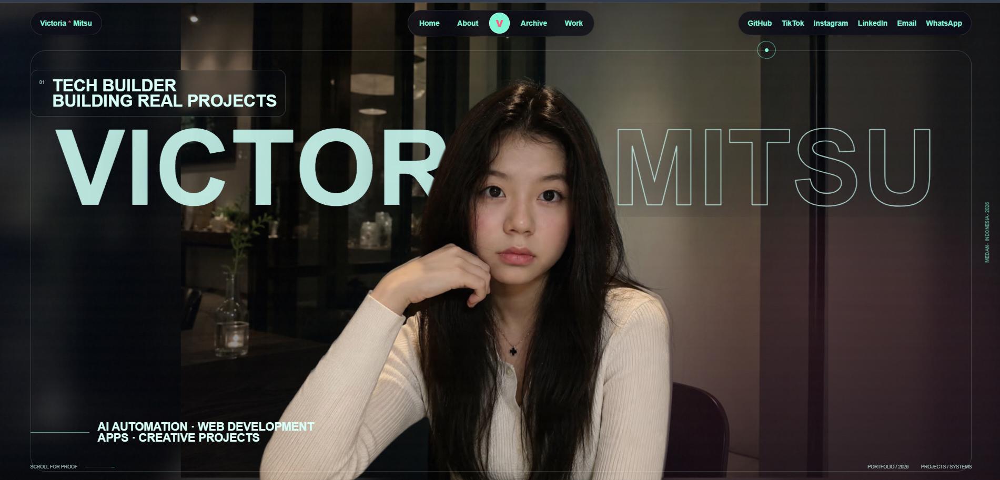

# Victoria Mitsu — Portfolio

My personal portfolio for selected software projects, competition work, robotics experience, and community involvement.

[**Visit victoriamitsu.com**](https://victoriamitsu.com)

<p align="center">
  <a href="https://victoriamitsu.com">
    
  </a>
</p>

## About the project

The website is designed as a continuous visual story rather than a standard grid of cards. It opens with a portrait-led introduction, then moves through selected work, competition highlights, a complete achievement archive, professional experience, and contact information.

The goal is to keep the experience expressive while preserving readability, accessibility, search visibility, and mobile performance.

## Highlights

- Responsive portrait-led landing page
- Scroll-based project and achievement storytelling
- Interactive competition archive with 31 recorded results
- Reusable project case-study structure
- Keyboard focus and reduced-motion support
- Adaptive WebGL loading for lower-powered devices
- Canonical metadata, Open Graph previews, structured data, sitemap, robots directives, and web manifest

## Technology

| Area | Tools |
| --- | --- |
| Framework | Next.js App Router, React, TypeScript |
| Styling | SCSS Modules, responsive CSS, CSS custom properties |
| Motion | GSAP, ScrollTrigger, Lenis |
| Graphics | Three.js, React Three Fiber, GLSL |
| State | Zustand |
| Deployment | Vercel |

## Project structure

```text
src/
├── app/          Routes, metadata, sitemap, and social preview assets
├── components/   Homepage sections, shared layout, motion, and WebGL
├── data/         Project and achievement content
├── hooks/        Client capability and rendering hooks
├── lib/          Shared setup and utilities
└── styles/       Global styles, tokens, and resets

public/media/     Portfolio, project, and achievement media
```

## Run locally

Requirements: Node.js 20 or newer and npm.

```bash
npm install
npm run dev
```

Open [http://localhost:3000](http://localhost:3000).

## Environment

Copy `.env.example` to `.env.local`:

```bash
NEXT_PUBLIC_SITE_URL=https://your-domain.com
NEXT_PUBLIC_GOOGLE_SITE_VERIFICATION=your-verification-token
```

`NEXT_PUBLIC_GOOGLE_SITE_VERIFICATION` is optional. Use only the verification token from Google Search Console.

## Production checks

```bash
npm run lint
npm run build
npm run start
```

Every pull request also runs linting and a production build through GitHub Actions.

## Main routes

- `/` — complete portfolio
- `/work` — project index
- `/work/chery-medan-amplas` — project case study
- `/about` — redirects to the About section
- `/achievements` — redirects to the Competition Record
- `/robots.txt` — crawler directives
- `/sitemap.xml` — indexable routes

## Content rights

This is a public source repository, but it is not a reusable portfolio template. The writing, photographs, videos, project materials, and competition documentation belong to Victoria Mitsu. Please do not reuse or redistribute them without permission.
